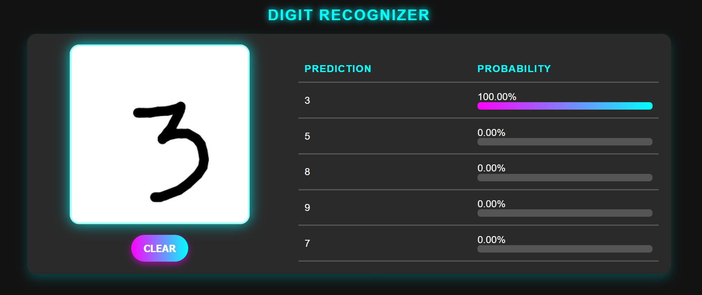
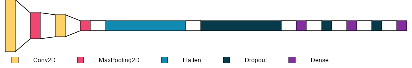
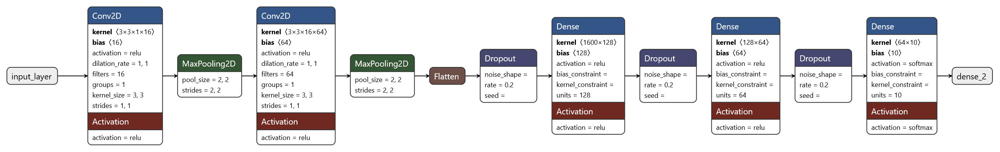
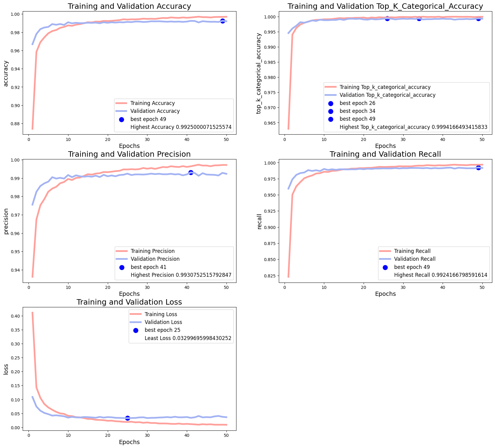
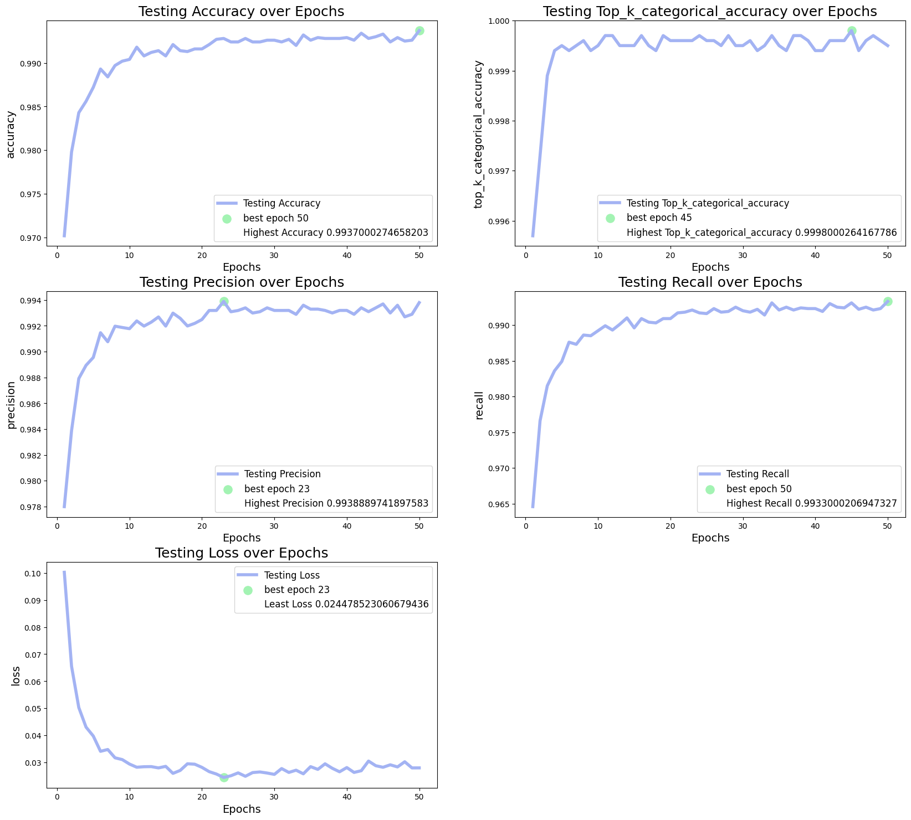
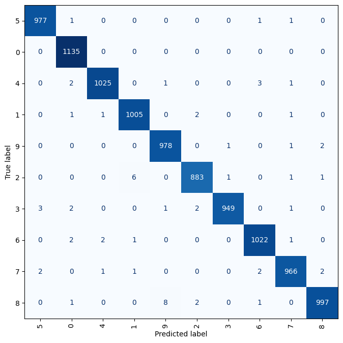

# 🧠 DigitRecognizer: Handwritten Digit Classification with CNN

This project focuses on developing a **Convolutional Neural Network (CNN)** model for recognizing handwritten digits (0-9) using the **MNIST dataset**. The model is trained to accurately classify digits and is deployed with an interactive UI for real-time digit recognition. The project contains the trained model, weights, and a user-friendly interface.



---
## 🚀 **Deployed in HuggingFace Space**
- The Modela and GUI have been deployed in HuggingFace Space.
- Access it from [here](https://huggingface.co/Spaces/Rahul-Samedavar/DigitRecognizer)

---

## 🚀 **Features**
- Real-time digit classification with interactive drawing canvas
- Preprocessing pipeline to normalize and reshape input data
- **Custom CNN model** optimized for digit classification
- Confidence-based prediction with **probability bar visualization**
- Intuitive UI with a Dark Neon theme

---

## 🛠️ **Installation & Setup**

### 1️⃣ **Clone the Repository**
```bash
git clone https://github.com/Rahul-Samedavar/DigitRecognizer.git
cd DigitRecognizer
```

### 2️⃣ **Create Virtual Environment (Optional)**
To avoid version conflicts, create a virtual environment:
```bash
python -m venv env
```
Activate the environment:

- **Windows:**
```bash
env\Scripts\activate
```

- **Linux/Mac:**
```bash
source env/bin/activate
```

### 3️⃣ **Install Dependencies**
Install the required Python libraries:
```bash
pip install -r requirements.txt
```

### 4️⃣ **Run the Application**
```bash
python app.py
```
Access the application at `http://localhost:5000`.

---

## 🔥 **Model Methodology**

### **1. Dataset Preparation**
- The project uses the **MNIST dataset**, which contains **60,000 training images** and **10,000 testing images** of handwritten digits (0-9).
- Each image is grayscale with a resolution of **28x28 pixels**.


- **Preprocessing Steps:**
    - Images resized to **28x28 grayscale** format.
    - Pixel values normalized to a **[0, 1]** range for improved model convergence.
    - Labels converted to **one-hot encoding** for multi-class classification.
---


### **2. Model Architecture**
A CNN architecture with the following layers was designed:

```python
model = Sequential([
    Conv2D(16, (3,3), activation='relu', input_shape=(28, 28, 1)),
    MaxPooling2D(2,2),
    Conv2D(64, (3,3), activation='relu'),
    MaxPooling2D(2,2),
    Flatten(),
    Dropout(0.2),
    Dense(128, activation='relu'),
    Dropout(0.2),
    Dense(64, activation='relu'),
    Dropout(0.2),
    Dense(10, activation='softmax') 
])
```




---

### **3. Loss Function & Optimization**
- **Loss Function:** Categorical Crossentropy (suitable for multi-class classification)
- **Optimizer:** Adamax (to learn on noisy data)
- **Learning Rate:** 0.001 (tuned for optimal performance)
```python

model.compile(
    optimizer=Adamax(0.001),
    loss='categorical_crossentropy',
    metrics=['accuracy',  TopKCategoricalAccuracy(3), Precision(), Recall()])
```

---

### **4. Training Process**
- **Train-Test Split:** 85% training and 15% validation
- **Batch Size:** 32 for memory efficiency
- **Epochs:** 50
- **Model Checkpointing:** Save the model at each epoch to preserve the best-performing weights.

```python
from tensorflow.keras.callbacks import ModelCheckpoint

checkpoint = ModelCheckpoint(
    filepath = "Models/model_epoch_{epoch:02}.keras",
    save_weights_only = False,
    save_best_only = False,
    monitor = 'val_loss',
    mode = 'min',
    verbose = 0
)
```


---

### **5. Testing & Model Selection**
- Models were evaluated on the test dataset



**Results:**
- **Best Accuracy**: **99.37%** epoch 50
- **Best Top k Accuracy**: **99.94%** epooch 45




- The confusion matrix shows minimal misclassifications, indicating the model's high accuracy.
- Most errors occur between digits with similar shapes, such as **9 and 8**.

---

## 📊 **Results & Performance**
- **Best Accuracy:** 99.37%
- **Best Top K Accuracy:** 99.98%
- **Best Precision:** 99.39%
- **Best Recall:** 99.33%
- **Inference Speed:** ~40ms per image (real-time)

---

⭐️ If you liked the project, give it a star! 🌟